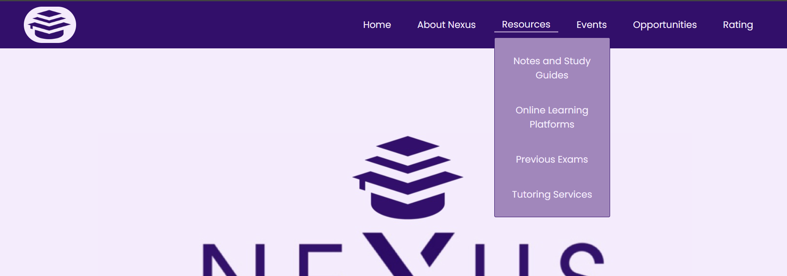

# Nexus-Student-Hub

A front-end website built for university students to access academic resources, study materials, and opportunities.

## Features
- HTML/CSS/JavaScript only (no backend)
- Clean and responsive layout
- Sections for:
  - Resources (Notes and Study Guides, Online Learning Platforms, Previouses, Tutoring Services, etc.)
  - Opportunities (Internships, Scholarships, Workshops, Career Path Navigator, etc.)
  - Ratings (Find ratings for courses or professors, share your own ratings)
  - Events (Explore latest events, workshops, and seminars in your university)
 
  ## Technologies Used
  - HTML
  - CSS
  - JavaScript
 
  ## How to Run
  1. Download or clone the repository
  2. Open 'home.html' in any browser
 
  ## Some Screenshots of Layout/Design

  ### Navigation Design
  

  ### Sign up/ Sign in Design
  

  ### Home Design
  

  ## Footer Design
  

  ## Resources Design
  

  ## Previouses/Resources Design
  

  ## Tutoring/Resources Design
  

  ## Opportunities Design
  

  ## Career Path Navigator/Opportunities Design
  

  ## Ratings Design
  
  
